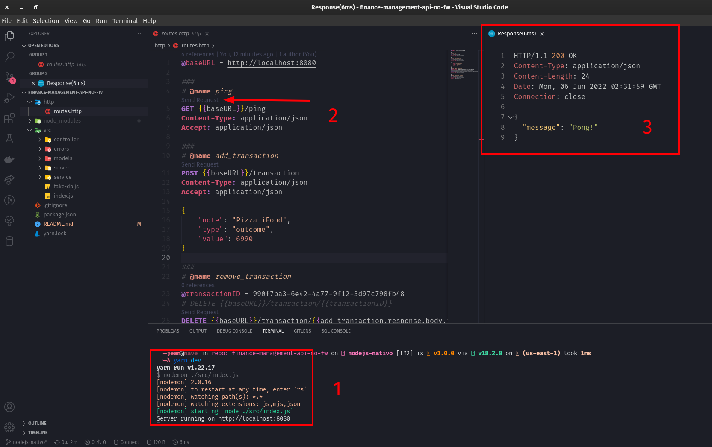

# Finance gestor

Esta é uma API criada somente com NodeJS nativo para fins de estudo

# Tabela de conteúdos

- [Primeiros passos](#footprints-primeiros-passos)
- [Rodando o projeto](#runner-rodando-o-projeto)
- [A Api](#computer-a-api)
- [Playlist](#book-playlist)

# :footprints: Primeiros passos

Primeiro certifique-se de ter as seguintes ferramentas instaladas:
- [Git](https://git-scm.com/book/en/v2/Getting-Started-Installing-Git)
- [NodeJS e npm](https://nodejs.org/en/)
- [npm](https://nodejs.org/en/)
- [yarn](#instalar-yarn)

# :runner: Rodando o projeto

Primeiro clone o projeto:
```shell
git clone --branch entrypoint https://github.com/jeanmolossi/cautious-octo-goggles.git introducao-nodejs
```
Acesse a pasta:
```shell
cd introducao-nodejs
```

**Se você clonou a branch `entrypoint` provavelmente seu projeto estará vazio. Entretanto, se você clonou a partir da branch nodejs-nativo poderá executar:**
```shell
yarn dev
```

### Executando as requests

Após seu projeto rodar com sucesso, acesse a pasta: `http`, você encontrará um arquivo de requests. Para conseguir executál-as você precisa da extensão [REST Client](https://marketplace.visualstudio.com/items?itemName=humao.rest-client).

Para instalar a extensão:

Em seu VSCode aperte simultaneamente as teclas (Ctrl + P) e cole o seguinte comando: `ext install humao.rest-client`

Com a extensão instalada basta clicar em `send request` que aparece em cima do host de cada chamada.

[](./docs/rest-client.png)

- **1** - Certifique-se que a aplicação está executando
- **2** - Clique em send request
- **3** - Receba o retorno da API

# :computer: A Api

### Funcionalidades

- [x] Criar entrada de caixa
- [x] Criar saída de caixa
- [x] Histórico de entradas e saídas

### Modelos

**Modelo de entrada**
```json
{
	"id": "random-uuid",
	"note": "Pizza iFood",
	"type": "outcome",
	"value": 6990,
	"created_at": "2022-06-04T15:01:23.000Z"
}
```

**Modelo de saída**
```json
{
	"id": "random-uuid",
	"note": "Salário",
	"type": "income",
	"value": 160087,
	"created_at": "2022-06-04T15:01:23.000Z"
}
```

**Rotas da api**

| Caminho | Método | Ação |
|:---:|:---:|:---|
|  /ping                | **GET**   | Rota para checar saúde da aplicação |
|  /transaction         | **POST**  | Cadastro de nova transação          |
|  /transaction/{{id}}  | **DELETE**| Excluir transação                   |
|  /transactions        | **GET**   | Recupera o histórico de transações  |

### Material auxiliar

- [Criar testar e aprender RegExp](https://regex101.com/)
- [Como funciona o regex de rotas](https://regex101.com/r/Vw7fH1/1)

# :book: Playlist

**[Inscreva-se no canal](https://www.youtube.com/channel/UCWQyi_jJN_C-yVffPleNlaQ?sub_confirmation=1&utm_source=github&utm_campaing=finance-management-api-no-fw)**

- [Aula 01](https://www.youtube.com/watch?v=10jVqDUXyEg)

#### Instalar Yarn

```shell
npm install --global yarn && \
yarn --version
```